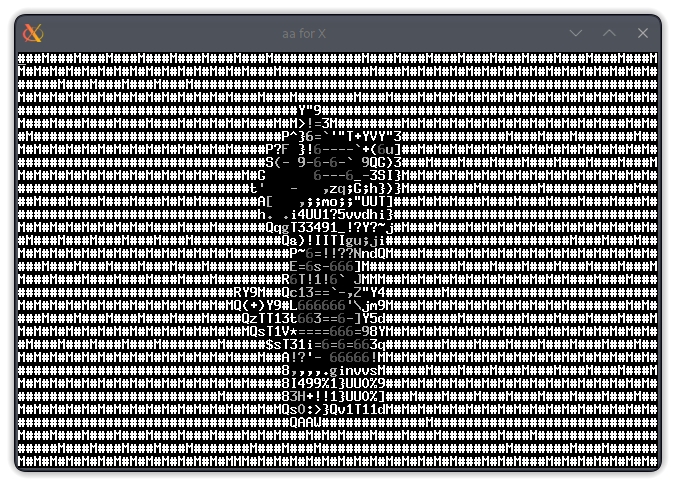
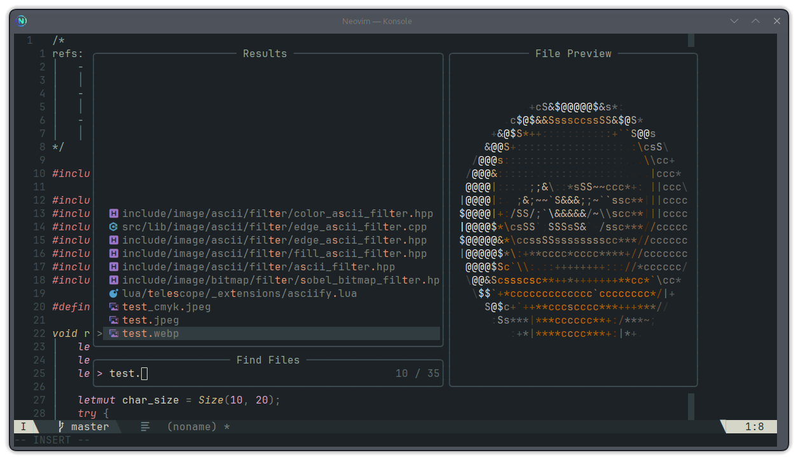
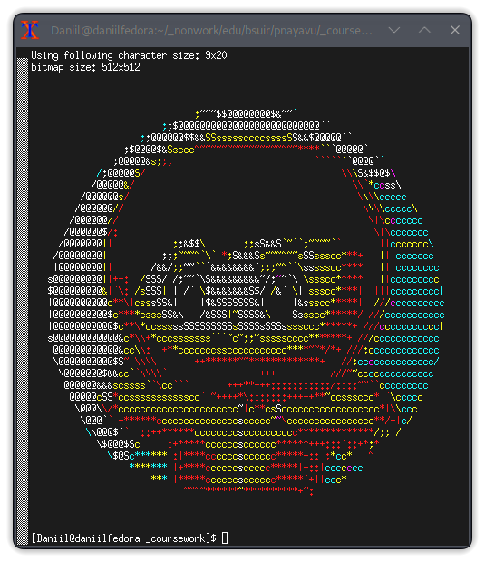

# asciify

Это курсовая работа по теме "ASCII-renderer". В ней рассказывается о разработке C++ библиотеки для рендеринга ASCII-арта, а также о её интеграции с Neovim и Telescope. Она работает как обычный плагин для Neovim и расширение для Telescope, но не совсем подходит для повседневного использования. Особенно это касается работы Lua-части: она использует предварительно собранный shared object, что означает, что она будет работать только на Linux с такими же версиями библиотек; она заменяет стандартный просмотрщик Telescope на кастомный и использует стандартный только как фоллбек, что означает, что она пытается открыть каждый файл в каждом из поддерживаемых форматов, и тольео если всё провалится, то использует стандартный просмотрщик, что иногда вызвает лаги при навигации по файлам; также она не поддерживает PNG, который, по сути, является самым популярным форматом. Поэтому я не вижу причин, по которым кто-то стал бы использовать этот плагин в его текущем состоянии.

Несмотря на всё вышесказанное, это может стать хорошим вдохновением или основой для ваших проектов.

Ниже представлен текст пояснительной записки:

# ВВЕДЕНИЕ 

В настоящей работе рассматриваются принципы разработки и демонстрируются практические возможности ASCII-рендерера - программная система для преобразования растровых изображений в соответствующие им текстовые представления. Кроме того, реализована интеграция разработанного ASCII-рендерера с текстовым редактором Neovim в качестве плагина для предпросмотра растровых изображений.

Процесс разработки системы можно разделить на следующие смысловые части:

1. Загрузка растрового изображения в стандартном формате.

2. Преобразование растрового изображения в его текстовое представления.

3. Вывод полученного текстового представления исходного изображения на экран (используя, например, эмулятор терминала) или в текстовый файл.

Разработанная система может использоваться для получения текстовых представлений растровых изображений в различных целях:

- создание текстовых логотипов и баннеров;

- просмотр изображений в средах с ограниченными возможностями отображения (например, эмуляторы терминала или некоторые мессенджеры);

- просто для развлечения.

# 1 ОБЗОР ЛИТЕРАТУРЫ

## 1.1 Обзор методов и алгоритмов решения поставленной задачи

Компьютерная графика представляет собой быстро развивающуюся область, характеризующуюся постоянным совершенствованием технологий и появлением новых стилистических направлений. Параллельно наблюдается стремительное устаревание ранее актуальных визуальных стилей. Так, то, что еще недавно воспринималось как эталон реализма, сегодня может выглядеть примитивно и неэстетично. Однако, некоторые стили, утратившие былую популярность, неожиданно переживают возрождение. Яркими примерами подобного явления служат эстетика игровых консолей Sony PlayStation 1, визуальный стиль игры Quake, пиксельная графика и ASCII-арт. Последний, несмотря на свою минималистичность, обладает особым эстетическим привлекательностью и вызывает ностальгические чувства. Возникнув как следствие ограниченных возможностей первых персональных компьютеров 70-х и начала 80-х годов, способных отображать исключительно текстовую информацию, ASCII-арт сегодня вновь пользуется популярностью в качестве художественного средства выражения и инструмента для создания уникальных визуальных эффектов.

Задача синтеза текстовых изображений (ASCII-арта) может быть решена различными методами. Наиболее распространенным подходом является применение эффектов постобработки к готовым изображениям. Данный метод обладает рядом преимуществ, таких как независимость от конкретной технологии рендеринга и возможность применения к существующим изображениям (например, фотографиям). Однако, существенным недостатком этого подхода является ограниченная гибкость в управлении отдельными элементами полученного ASCII-арта. Несмотря на вышеуказанное ограничение, в рамках данного проекта был выбран именно метод постобработки ввиду его относительной простоты и возможности достижения выразительных результатов.

Процесс генерации ASCII-арта может быть представлен как последовательность следующих этапов:

1. Дискретизация изображения: исходное изображение разбивается на регулярную сетку ячеек, размер которых соответствует размеру символа.

2. Процесс заливки: каждой ячейке сопоставляется символ из заданного алфавита в зависимости от ее средней яркости.

3. Выделение границ:  

   3.1. Выделение границ изображения, осуществляемое с помощью специализированных алгоритмов.

   3.2. Для ячеек, пересекаемых границами, выбирается символ из заданного алфавита, отражающий характер границы (например, угол наклона).

4. Процесс раскраски: каждой ячейке присваивается цвет на основе среднего значения цвета в ней. В качестве этого значения может выступать как положение цвета в пространстве RGB, так и индекс одного из восьми цветов спецификации ANSI. Так как при выводе в эмулятор терминала применение раскраски в основном достигается с помощью управляющих символов ANSI, такие изображения, строго говоря, относятся не к ASCII, а к ANSI-арт.

Следует отметить, что различные реализации алгоритмов синтеза ASCII-арта могут включать различные комбинации указанных этапов, что приводит к существенным визуальном различиям в результирующем изображении.

## 1.2 Обзор информационных технологий решения задачи

Традиционно ASCII-арт применялся для визуализации изображений в текстовых средах, таких как эмуляторы терминалов. Однако, благодаря своему высокому художественному потенциалу, ASCII-арт нашел применение и в других областях. Он позволяет создавать уникальные визуальные стили и эффекты, что делает его ценным инструментом для дизайнеров и художников.

Одним из наиболее популярных инструментов для создания ASCII-арта является библиотека aalib. Она предоставляет разработчикам широкий набор функций для преобразования растровых изображений в текстовые форматы, поддерживая различные кодировки символов и позволяя настраивать качество рендеринга. Типичным примером использования aalib служит медиаплеер VLC, который поддерживает режим воспроизведения видео в виде ASCII-арта (см. рисунок 1.1).

ASCII-арт нашел применение и в игровой индустрии. Например, в видеоигре Returnal эффект ASCII-арта, реализованный в виде шейдера для фоторежима, позволяет игрокам создавать уникальные стилизованные скриншоты.\ Несмотря на свои преимущества, ASCII-арт имеет и ограничения. Низкое разрешение, ограниченный цветовой диапазон и сложность создания комплексных трехмерных сцен являются основными препятствиями для его повсеместного применения в современных графических приложениях.

## 1.3. Постановка задачи. Структура входных и выходных данных

В рамках данного проекта разрабатывается программная система, осуществляющая преобразование растровых изображений в ASCII-арт.

Входные данные:

1. Растровое изображение в стандартном формате (например, JPEG или WebP). Формат WebP был выбран из-за относительной простоты работы с ним и поддержки анимированных изображений, позволяя потенциально добавить поддержку анимированных изображений. Формат JPEG - для демонстрации возможности поддержки различных форматов.

2. Параметры:  

   - Палитра символов заливки.

   - Палитра символов границ.

   - Минимальное пороговое значение интенсивности границы.

   - Дополнительные параметры границ для алгоритма «разница по Гауссу».

   - Режим отображения цвета (без цвета, стандартные цвета ASCII или цвета RGB).

   - Список эффектов, которые будут применены в указанном порядке.

Выходные данные: вывод ASCII-арта, соответствующего исходному изображению.

Функциональные требования:

1. Алгоритмическое преобразование растрового изображения в соответствующий ему ASCII-арт с учетом заданных параметров.

2. Возможность гибкой настройки параметров преобразования для получения различных визуальных стилей.

3. Простота и удобство использования и конфигурации.

# 2 ФУНКЦИОНАЛЬНОЕ ПРОЕКТИРОВАНИЕ

Для реализации данного проекта был выбран язык программирования C++. Это обусловлено его широкими возможностями в области обработки изображений, наличием богатой стандартной библиотекой и эффективной поддержкой принципов объектно-ориентированного программирования (ООП). Высокая производительность языка, сравнимая с языком С, позволяет эффективно решать поставленные в данном проекте задачи.

> На самом деле язык был выбран людьми составлявшими программу обучения в университете и если бы у меня был выбор, в случае программирования для CPU, я бы выбрал C, так как (по моему опыту) проекты на C++ имеют сильную тенденцию к неоправданному разрастанию. Да и вообще C++ - неэстетичный.

## 2.1 Разработка диаграммы классов

Диаграмма классов - структурная диаграмма языка моделирования UML, демонстрирующая общую структуру иерархии классов системы, их коопераций, полей, методов и взаимосвязей между ними. Цель диаграммы классов - дать общее представление о структуре системы, выявить основные объекты и их взаимосвязи. Это позволяет оценить полноту и логичность модели, а также служит основой для дальнейшей разработки системы.

[Диаграмма классов](class_diagram.pdf)

## 2.2 Описание классов

Все классы системы можно разделить на несколько категорий:

- Наиболее общие классы системы - разработаны для использования практически по всей системе. В эту категорию входят, например, класс для работы с изображениями и структуры для представления позиции и цвета.

- Классы для работы с растровыми изображениями - классы, никак не зависящие от ASCII-арта, предназначенные только для работы с растровыми изображениями.

- Классы для работы с ASCII-артом - классы, предназначенные для создания, обработки и вывода ASCII-арта. Могут зависеть от классов работы с растровыми изображениями.

- Вспомогательные классы для дополнительных функций системы.

Так как C++ является мультипарадигменным языком прокраммирования, код не обязательно должен состоять только из классов. По этой причине другими составными частями системы можно выделить модули - группы одного и более файлов исходного кода, объединенных схожей функциональностью и не содержащих классы.

Среди модулей системы стоит отдельно выделить модуль пользовательского интерфейса, написанный на языке Lua в качестве плагина для текстового редактора Neovim. Являясь скриптовым языком с динамической типизацией, Lua предоставляет широкие возможности для написания конфигураций и пользовательского интерфейса.

### 2.2.1 Наиболее общие классы системы

В основе системы лежит шаблонный класс контейнера `Image<T>`. Параметр шаблона `T` определяет тип пикселя, что позволяет использовать данный класс в различных задачах. Изображение хранится в виде массива по строкам в «куче». Класс предоставляет методы для доступа к пикселям и размеру, а также итератор `Image<T>::Iterator` для последовательного перебора пикселей. Вложенный класс `Image<T>::Region` позволяет эффективно работать с подобластями изображения.

`Size` и `Pos` - структуры, представляющие размеры и координаты соответственно. Используются по всему коду системы. Структуры хранят компоненты в целочисленных шестнадцатибитных переменных, что имеет смысл для работы с изображениями. Кроме того, для них реализованы алгебраические операторы для удобного выполнения геометрических вычислений (сложение и вычитание векторов, сравнение).

`Color` - структура, представляющая цвет в RGB модели. Компоненты цвета хранятся в виде чисел с плавающей запятой. Реализованы функции для вычисления яркости (`luminance()`) и величины цвета (`magnitude()` и `sqr_magnitude()`), а также алгебраические операторы для упрощения манипуляции с цветами.

Шаблонный интерфейс `ImageFilter<T>` определяет общий контракт для фильтров, применяемых к изображениям. Несмотря на название, может быть реализован для любого типа. Фильтры могут выполнять любые преобразования над изображением, не меняющие его размера. Дружественный оператор «`*=`» позволяет применять фильтры к изображениям интуитивно и очевидно показывает, что фильтр может изменить объект изображения.

### 2.2.2 Классы для работы с растровыми изображениями

Класс `Bitmap` является основным при работе с растровыми изображениями. Является дочерним от `Image<Color>` и служит для хранения последовательности цветов растрового изображения.

Класс `BitmapCodec` служит для декодирования (загрузки) и потенциального кодирования (сохранения) изображений. Реализация статического метода `BitmapCodec::decode()` загружает изображение любого поддерживаемого формата с помощью методов дочерних классов. Содержит также две вложенных структуры ошибок, наследованных от стандартной `std::exception`: абстрактную `BitmapCodec::DecodingException` (используется дочерними классами для реализации своих ошибок) и `BitmapCodec::UnsupportedFormatException` (генерируется в случае, когда ни один декодер не смог декодировать изображение).

Два дочерних класса `BitmapCodec` - `JpegCodec` и `WebpCodec` используют библиотеки `libjpeg` и `libwebp` соответственно для загрузки отдельных форматов изображений. Кроме того, вложенные структуры ошибок, реализующие `BitmapCodec::DecodingException` - `JpegCodec::InternalDecodingException` и `JpegCodec::InvalidHeaderDecodingException` - используются при наличии исключительных ситуаций в процессе декодирования изображения в формате JPEG.

Интерфейс `BitmapFilter` наследует `ImageFilter<Bitmap>` и добавляет вложенную структуру `BitmapFilter::CnvlKernel<T, W, H>`, которая является ключевой для реализации всех конкретных фильтров над растровыми изображениями. Она представляет из себя ядро для выполнения операции свертки размером WxH, которое может быть применено к изображению, для получения широкого спектра визуальных эффектов. Строктура имеет два конструктора - на основе матрицы, и на основе функции, максимально абстрагируясь от конкретного ядра. Это позволяет значительно сократить код дочерних фильтров, а некоторые даже убрать за ненадобностью. Сама структура `CnvlKernel` хранит матрицу элементов типа `T`, которая используется в методе `BitmapFilter::CnvlKernel::apply()` для применения операции свертки к изображению. Алгоритм данного метода подробно описан в подразделе 3.2.2.

Классы `DoGBitmapFilter` и `SobelBitmapFilter`, реализующие `BitmapFilter`, служит для применения фильтров «разница по Гауссу» и «оператор Собеля» соответственно к изображению. Вложенный класс `DoGBitmapFilter::GaussianKernel<S>` служит для упрощения создания ядер свертки размером `S`x`S` на основе двумерной функции Гаусса. Данные фильтры являются основой реализации алгоритма выделения границ, подробно описанного в подразделе 3.2.1.

### 2.2.3 Классы для работы с ASCII-артом

Структура `AsciiEl` - универсальный хранитель информации об элементе ASCII-арта (сам символ и его цвет).

Класс `Ascii` представляет собой ASCII-арт как таковой. Являясь дочерним от `Image<AsciiEl>`, хранит последовательность специальных элементов. Создается на основе исходного изображения (используется в фильтрах), размера поля в символах и размера символа.

Класс `AsciiWriter` служит для вывода ASCII-арта в стандартный поток и файл (по имени). Создается на основе ASCII-арта и размера поля вывода в символах. Основной особенностью данного класса является наличие в методах записи дополнительного параметра, определяющего режим раскраски: ее отсутствие (полезно, например, для отправки в текстовом сообщении, где нет поддержки управляющих последовательностей ANSI), стандартный ANSI, использующий до восьми различных цветов, и более современный «true color», который позволяет использовать все 16,7 миллионов цветов пространства RGB, но может не поддерживаться в старых эмуляторах терминала.

Класс `AsciiFilter`, реализующий `ImageFilter<Ascii>` нужен только ради лучшей читаемости кода и потенциального расширения системы в будущем. На данный момент остался пустым.

В системе реализованно три фильтра, каждый из которых отвечает за одну
конкретную характеристику получаемого изображения:

- `FillAsciiFilter` (применение заливки) - определяет соответствие между средней яркостью областей исходного изображения и символами ASCII, формируя основу для дальнейшей обработки. 

- `ColorAsciiFilter` (применение раскраски) - определяет соответствие между средним цветом областей исходного изображения и символами ASCII.

- `EdgeAsciiFilter` (определение границ) - выделяет границы объектов на изображении и отображает их соответствующими символами ASCII, основываясь на форме (в нашем случае учитывается угол наклона).

Эффекты могут быть применены в любом порядке и в любых комбинациях. Использованный композиционный подход обладает рядом преимуществ:

- Простота расширяемости системы посредством добавления новых эффектов.

- Возможность применять эффекты во всех возможных комбинациях, что может быть затруднительно при использовании наследования.

### 2.2.4 Вспомогательные классы и модули

Класс `Font` позволяет вычислить размер символа в пикселях на основе заданной высоты в пунктах, что необходимо для сохранения пропорций исходного изображения при использовании шрифтов с произвольным соотношением сторон. Статический метод `Font::load()` загружает файл шрифта с использованием библиотеки `libfreetype`, предоставляющей мощные инструменты для работы со шрифтами. В случае возникновения ошибок при загрузке шрифта генерируется ошибка `Font::InternalLoadingException`, дочерняя от `std::exception`.

Главный модуль `main.cpp` может потенциально использоваться как для реализации командной строки интерфейса, так и в качестве заглушки для будущих модулей пользовательского интерфейса. На текущем этапе данный модуль предоставляет простой и быстрый способ демонстрации возможностей ASCII-рендерера.

Связующий модуль `c_glue.cpp` делает основные функции легкодоступными из динамически связываемой библиотеки. Она в свою очередь используется модулем пользовательского интерфейса для простого доступа к функциям программного интерфейса.

### 2.2.5 Модуль пользовательского интерфейса

Данный модуль можно разделить на два подмодуля:

1. Интерфейс внешних функций (FFI) и подключение динамически связываемой библиотеки к Lua. Ключевым элементом обращения к функциональности разработанного ASCII-рендерера из Lua является механизм FFI. FFI предоставляет «мост» между двумя языками, позволяя вызывать функции, написанные на одном языке, в коде, написанном на другом. В нашем случае, FFI используется для вызова функций, написанных на С++ из скриптов Lua. Для работы FFI необходима динамически связываемая библиотека, экспортирующая необходимые функции для внешних вызовов. Для этого со стороны C++ необходимо создать необходимые функции в соответствии с правилами языка C, помеченные специальным атрибутам «`extern "C"`». Это позволяет скрипту Lua точно определить имя функции при вызове, избегая проблем, связанных с возможным переименованием функций компилятором С++. Для упрощения работы с памятью реализована метатаблица (аналог родительского класса в Lua) `Native` и несколько таблиц (аналог класса) для простого использования экспортированных функций ASCII-рендерера в виде объектно-ориентированного интерфейса.

2. Расширение функциональности Telescope для предпросмотра изображений. Для реализации предварительного просмотра изображений в текстовом редакторе Neovim было выбрано популярное расширение Telescope. Это расширение позволяет осуществлять интерактивный поиск по различным источникам данных, включая файлы, буферы и историю коммитов, а также и выполнять действия с результатами поиска. Telescope ориентирован на модульность, что открывает широкие возможности для его кастомизации. В рамках данного проекта Telescope был расширен функциональностью предпросмотра изображений, основанной на разработанном ASCII-рендерере. Для этого с использованием экспортированных таблиц Telescope создается «предпросмотрщик» - таблица, содержащая функцию для предпросмотра файлов по заданному пути. В этой функции, используя вышеупомянутый подмодуль, загружается изображение; определяется моноширинный шрифт пользователя; с применением пользовательского набора и параметров эффектов создается ASCII-арт и выводится в полученный от Telescope буфер. В случае ошибки или неподдерживаемого формата, используется предпросмотрщик Telescope по умолчанию. Это позволило интегрировать предпросмотрщик изображений в Telescope, не лишаясь встроенного функционала. Для упрощения настройки и использования нового функционала был использован специальный механизм расширений Telescope, регистрирующий расширение и позволяющий пользователям указывать желаемые параметры рендеринга.

# 3 РАЗРАБОТКА ПРОГРАММНЫХ МОДУЛЕЙ

## 3.1 Разработка схем алгоритмов

Для разработки схем алгоритмов было выбрано два наиболее важных метода, `EdgeAsciiFilter::operator()()` и `BitmapFilter::CnvlKernel::apply()`, так как они являются наиболее сложными алгоритмами системы. 

[Схема алгоритма `EdgeAsciiFilter::operator()()`](flowchart_EdgeAsciiFilter.pdf)

> Так как [оригинальная схема](flowchart_CnvlKernel_non_simplified.pdf) не поместилась на лист A4, она была упрощена до версии, которая хоть и проще, но менее оптимизированна. 

[Схема алгоритма `BitmapFilter::CnvlKernel::apply()`](flowchart_CnvlKernel.pdf)

## 3.2 Разработка алгоритмов

### 3.2.1 Разработка алгоритма метода `EdgeAsciiFilter::operator()()`

Данный метод отвечает за применение фильтра выделения границ к ASCII-арту. Он реализует виртуальный метод `AsciiFilter::operator()()`, использующийся для применения фильтров к ASCII-арту.

Метод можно разбить на следующие основные шаги:

1. Копирование исходного для ASCII-арта растрового изображения, чтобы исключить его случайное изменение.

2. Применение фильтров выделения границ (последовательно «разница по Гауссу» для улучшения характеристик изображения и «оператор Собеля» для вычисления приближенного значения градиента яркости изображения) к скопированному растровому изображению. В результате получено изображение градиента, содержащее информацию о приближенных частных производных изображения по горизонтали и вертикали в двух каналах (красном и зеленом).

3. В цикле для каждого элемента ASCII-арта:  

   1. Определяется регион изображения градиента, соответствующий текущему элементу ASCII-арта.

   2. В цикле для каждого пикселя в регионе:

      1. Вычисляется угол наклона границы с помощью функции `atan2()`.

      2.  На основе вычисленного угла вычисляется индекс символа границы из заданной палитры (принимая, что символы расположены в порядке, соответствующем углу наклона границ от 0 до &pi; или от -&pi; до 0).

      3.  В массив весов границ для вычисленной границы добавляется ее величина.

   3. Вычисляется вес границы для текущего элемента как сумма весов отдельно взятых границ. В случае, если результирующее значение меньше порогового значения, текущий элемент ASCII-арта остается неизменным и происходит переход к следующему.

   4. Вычисляется граница с максимальным весом. Текущий элемент ASCII-арта перезаписывается содержащим символ, соответствующий этой границе.

### 3.2.2 Разработка алгоритма метода BitmapFilter::CnvlKernel::apply()

Данный метод отвечает за применение произвольного ядра свертки к растровому изображению. Для избежания лишних копий, оперирует над уже готовыми изображениями, записывая в одно из них результат свертки другого.

Метод можно разбить на следующие основные шаги:

1. В цикле для каждого пикселя исходного изображения:  

   1.  Массив исходных пикселей заполняется из области вокруг текущей позиции.

   2.  Вычисляется взвешенная сумма пикселей области как сумма произведений исходных пикселей на соответствующие им элементы ядра.

   3.  Сумма записывается в результирующее изображение.

Можно заметить, что в вышеописанном алгоритме происходит много лишних чтений изображения. Это несложно предотвратить, чуть изменив последовательность хранения данных. Так как изображение хранится как последовательность строк, наилучшим вариантом является прохождение вдоль строк и хранение ядра и массива исходных пикселей как последовательности столбцов. Это позволит проходить по пикселям последовательно, и при движении вдоль строки смещать столбцы вместо повторного чтения из изображения.

# 4 РЕЗУЛЬТАТЫ РАБОТЫ ПРОГРАММЫ

В качестве результата работы программы как плагина для текстового редактора Neovim можно увидеть окно поиска файлов Telescope, где в качестве предпросмотрщика файла растрового изображения используется разработанный плагин (рисунок 4.1).

В качестве результата работы программы в режиме быстрой демонстрации, отдельно от разработанного плагина, можно увидеть преобразование растрового изображения формата WebP (рисунок 4.2, а) в ASCII-арт (рисунок 4.2, б) и вывод его в эмулятор терминала с использованием стандартных цветов ANSI. Демонстрация работы программы происходит в эмуляторе терминала xterm.

|   |
|---|
||
||

# ЗАКЛЮЧЕНИЕ

Проведенное исследование и разработка ASCII-рендерера позволили создать гибкий и эффективный инструмент для преобразования растровых изображений в текстовые аналоги. Реализованная система обладает широкими возможностями кастомизации и позволяет создавать ASCII-арты, которые могут использоваться для различных целей, от создания уникальных текстовых логотипов до визуализации данных.

В рамках проекта была разработана гибкая объектно-ориентированная система для преобразования растровых изображений в ASCII-арт. Система основана на принципах инкапсуляции данных и методов в классах, наследования классов и полиморфизма, что позволило создать расширяемую архитектуру. Шаблоны классов обеспечили универсальность системы, а иерархия классов позволила организовать код в логические группы и упростила его сопровождение.

Использование паттернов объектно-ориентированного проектирования позволило создать модульную систему, в которую легко добавлять новый функционал без существенной переработки существующего кода.

Разработанный ASCII-рендерер обладает гибкой конфигурацией, позволяющей пользователю выбирать различные фильтры и настраивать их параметры. Это делает инструмент универсальным и пригодным для решения широкого круга задач, связанных с преобразованием изображений в текст и созданием визуальных эффектов.

В ходе работы над проектом были успешно изучены принципы ООП и различные алгоритмы компьютерной графики. Знания и навыки, полученные в данном проекте, могут быть использованы в дальнейшем при разработке более сложных систем компьютерной графики.

# СПИСОК ИСПОЛЬЗОВАННЫХ ИСТОЧНИКОВ

\[1\]. Character representation of grey scale images \[Электронный
ресурс\]. - 1997 - Режим доступа:
https://paulbourke.net/dataformats/asciiart/ - Дата доступа:
25.10.2024.

\[2\]. Документ winnemoeller-cag2012.pdf \[Электронный ресурс\]. - 2012
- Режим доступа:
https://users.cs.northwestern.edu/\~sco590/winnemoeller-cag2012.pdf -
Дата доступа: 26.10.2024.

\[3\]. Документ example.c \[Электронный ресурс\]. - 2009 - Режим
доступа:
https://raw.githubusercontent.com/LuaDist/libjpeg/refs/heads/master/example.c
- Дата доступа: 03.11.2024.

\[4\]. WebP API Documentation \| Google for Developers \[Электронный
ресурс\]. - 2024 - Режим доступа:
https://developers.google.com/speed/webp/docs/api - Дата доступа:
03.11.2024.

\[5\]. FreeType Tutorial / I \[Электронный ресурс\]. - 2024 - Режим
доступа: <https://freetype.org/freetype2/docs/tutorial/step1.html> -
Дата доступа: 05.11.2024.

\[6\]. nvim-telescope/telescope.nvim: Find, Filter, Preview, Pick. All
lua, all the time. \[Электронный ресурс\]. - 2024 - Режим доступа:
https://github.com/nvim-telescope/telescope.nvim - Дата доступа:
10.11.2024.

\[7\]. telescope.nvim/developers.md at master \[Электронный ресурс\]. -
2024 - Режим доступа:
<https://github.com/nvim-telescope/telescope.nvim/blob/master/developers.md>
- Дата доступа: 10.11.2024.

\[8\]. I Tried Turning Games Into Text \[Видеозапись\]. - 2024 - Режим
доступа: https://www.youtube.com/watch?v=gg40RWiaHRY - Дата доступа:
11.11.2024.
